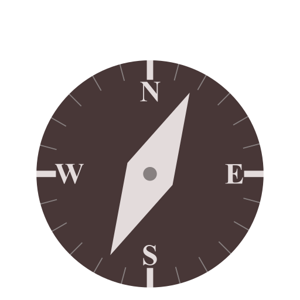
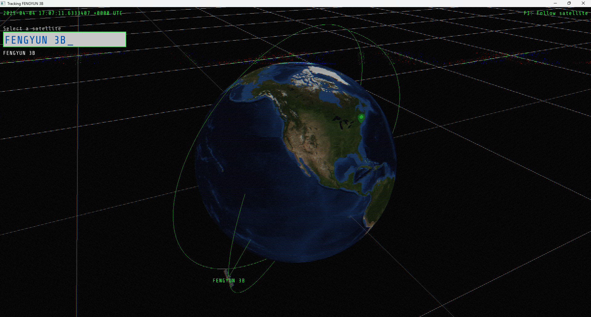
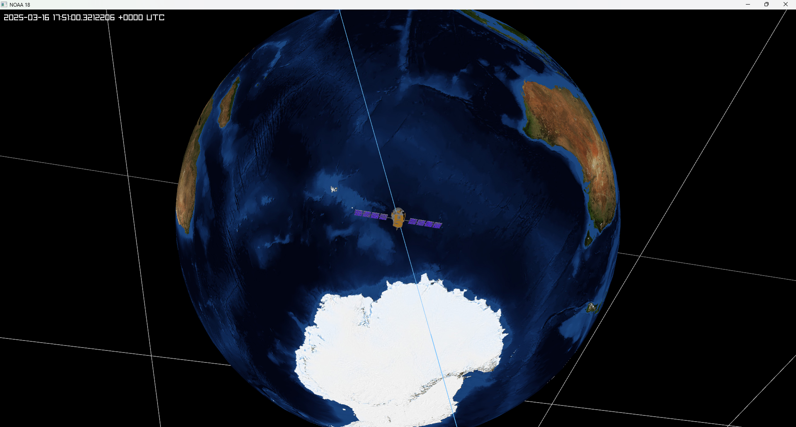

<br>

### gl-tracker is a tiny 3D satellite tracking program written in go + raylib bindings.

It let's you visualize and track satellite orbits in real time with a sick UI

<hr>




# Build instructions ⚒️:


## Windows
```
./build.bat
./run.bat
```

## Linux
```
./build.sh
./run.sh
```

Press ``F1`` to switch views

# Features
- Real time TLE fetching and caching
- Orbit visualisation
- Configurable with a config.ini file
- Interactive UI & Camera controls
- Cool sci-fi CRT shader
