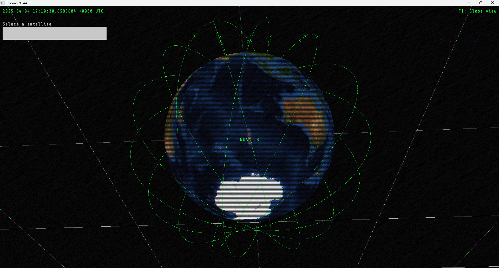

# gl-tracker
Tiny 3D satellite tracking program written in go + raylib bindings. 




# Usage:

run 

(linux)
```
./build.sh
./run.sh
```

(windows)
```
./build.bat
./run.bat
```

Press ``F1`` to switch views